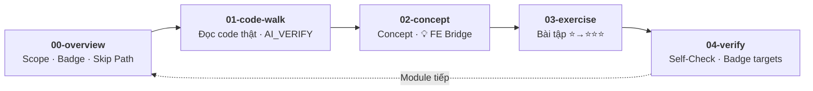

# Flutter Training — Codebase-Driven Learning Program

> **Dành cho:** Frontend Developer (React/Vue/Angular + TypeScript) chuyển sang Flutter
> **Thời lượng:** 9 tuần core + 1 tuần capstone · ~7–9 giờ/tuần
> **Cách học:** Đọc production code → Rút concept → Thực hành trên codebase thật → Verify
> **Source of Truth:** [`../base_flutter/`](../base_flutter/) — code snippets trong tài liệu được verify tự động với source

---

## 🚀 Bắt đầu từ đây (Day 1)

Bạn vừa mở folder `training/`. Đây là 30 phút đầu tiên:

1. **Mở VS Code** tại workspace root (folder chứa cả `base_flutter/` và `training/`)
2. **Chạy project:**
   ```bash
   cd ../base_flutter
   make setup          # cài dependencies + code generation
   flutter run          # xác nhận app build + chạy thành công
   ```
3. **Mở module đầu tiên:** [Module 0 — Dart Primer + Toolchain](module-00-dart-primer/00-overview.md)
4. **Làm Skip Path** — 10 câu self-assessment. Kết quả chia 3 nhánh: skip all, skip Dart only, hoặc skip Toolchain only. Senior React dev có thể bỏ qua đến 50%.
5. **Bắt đầu chu trình 5-file** — rhythm bạn sẽ lặp lại cho mỗi module từ đây đến M19.

> 💡 **Tip:** Cmd+Click (macOS) / Ctrl+Click trên bất kỳ link nào trong `.md` → mở thẳng file code trong VS Code. Tất cả links đều trỏ đúng file.

---

## 🧭 Chương trình này khác gì?

5 điều bạn sẽ không tìm thấy ở tutorial Flutter thông thường:

1. **Không có hello-world** — bạn học trên `base_flutter/`, một production codebase thật với Clean Architecture, Riverpod, Dio, auto_route, testing. Mở code → đọc → hiểu → practice, ngay từ module đầu.

2. **Skip Path — bỏ qua phần đã biết** — mỗi module mở đầu bằng 5–10 câu tự đánh giá. Đúng ≥80%? Bỏ qua, đi tiếp. M0 có 10 câu, 3 nhánh kết quả khác nhau. Không ai bắt bạn đọc lại thứ đã biết.

3. **163 FE↔Flutter bridges** — mỗi concept Flutter đều kèm callout "💡 FE Perspective" so sánh trực tiếp với React/Vue. `useState` → `useState` (gần giống hệt!). Redux/Pinia → Riverpod. Axios interceptors → Dio interceptors. Bạn chuyển đổi bằng ánh xạ, không bắt đầu từ zero.

4. **Badge System — biết chính xác phần nào tự code, phần nào dùng AI** — từng concept được gắn badge: 🔴 tự viết (không AI), 🟡 AI assist (review kỹ), 🟢 AI generate (verify). Không đoán mò.

5. **3 checkpoint liên tục, không đợi cuối khoá** — verify mỗi module → Mini Capstone ở tuần 4 → Full Capstone ở tuần 5. Bạn biết mình đứng đâu ngay từ giữa chương trình.

---

## 📋 Cách học — Chu trình 5 file

Mọi module (M0 → M23 + MA/MB/MC) đều có cùng cấu trúc 5 file. Bạn sẽ quen rhythm này từ tuần đầu:



### Mỗi file làm gì — cụ thể

| File | Bạn làm gì | Ví dụ thực tế (M0) |
|------|-----------|---------------------|
| **00-overview** | Đọc scope, làm Skip Path (5–10 câu). Quyết định skip hay học full. | 10 câu: 6 về Dart, 4 về Toolchain. 3 nhánh kết quả khác nhau. |
| **01-code-walk** | Đọc code thật trong `base_flutter/` theo guided tour. Mỗi block có câu hỏi gợi suy nghĩ. Snippets có `AI_VERIFY` tag — luôn đúng với source. | Đọc `pubspec.yaml`, `makefile`, `analysis_options.yaml` — hiểu project config. |
| **02-concept** | Concept rút ra TỪ code vừa đọc. Callout "💡 FE Perspective". Micro-task PRACTICE xen kẽ. | "Flutter: `pubspec.yaml` — tên, version, SDK constraint. React: `package.json` — `name`, `version`, `engines.node`. Khác: YAML format, quản lý cả assets/fonts." |
| **03-exercise** | ⭐ cơ bản → ⭐⭐ ứng dụng → ⭐⭐⭐ AI Prompt Dojo challenge. Làm trên codebase thật, push code. | ⭐⭐⭐: Viết prompt để AI generate toàn bộ config cho 1 Flutter project mới. |
| **04-verify** | Checklist tự kiểm tra gắn badge targets. Đạt threshold mới nên qua module tiếp. | "4/4 Yes cho 🔴 MUST-KNOW, tối thiểu 5/7 tổng" → đạt thì sang M1. |

### Ví dụ: một vòng M8 (Riverpod) trông thế nào?

1. **00-overview:** 8 câu self-assessment về state management → biết cần học phần nào
2. **01-code-walk:** Đọc `ProviderScope`, `StateNotifierProvider`, `ref.watch` trong `base_flutter/`
3. **02-concept:** Hiểu Riverpod qua FE Bridge — "Flutter `ProviderScope` ↔ React Redux `<Provider store={store}>` / Vue `app.use(createPinia())`. Khác biệt: Riverpod override ở provider level (granular)."
4. **03-exercise:** ⭐ Tạo simple provider → ⭐⭐ Implement state flow → ⭐⭐⭐ Prompt Dojo: viết prompt để AI tạo async provider với error handling
5. **04-verify:** 7 items, cần 4/4 🔴, tối thiểu 5/7 tổng → pass

---

## 🏷️ Badge System — Khi nào tự code, khi nào dùng AI

Mỗi concept trong mỗi module được gắn 1 badge. Badge quyết định **cách bạn học** concept đó:

| Badge | Chiếm ~% | Chiến lược học |
|-------|---------|----------------|
| 🔴 **MUST-KNOW** | 40–50% | **Tự code từ đầu**, không dùng AI generate. Đây là foundation — phải viết được khi offline. |
| 🟡 **SHOULD-KNOW** | 30–40% | **AI hỗ trợ, nhưng review kỹ.** Hiểu cách hoạt động, đọc được output, sửa được khi sai. |
| 🟢 **AI-GENERATE** | 15–25% | **AI gen thoải mái, chỉ verify.** Boilerplate, config — AI nhanh hơn, bạn chỉ cần biết output đúng chưa. |

### Badge trong thực tế: M8 — Riverpod

Badge distribution: **🔴 57% · 🟡 43% · 🟢 0%**

Không có concept nào trong Riverpod được phép delegate hoàn toàn cho AI. `ProviderScope`, `ref.watch`, `StateNotifier` — tất cả đều 🔴 hoặc 🟡. Đây là module nặng — plan thêm thời gian.

So sánh với M6 (Resource & Theme): 🟢 chiếm đa số — `ThemeData`, font config là boilerplate, AI gen hợp lý.

### Cách dùng badge khi tự học

- **Trước tuần mới:** Mở `00-overview.md` → xem badge distribution → biết module này "nặng" hay "nhẹ"
- **Khi đọc concept:** Mỗi concept trong `02-concept.md` có badge → biết đầu tư bao nhiêu
- **Khi verify:** Target trong `04-verify.md` gắn theo badge — phải 100% câu 🔴, ≥70% tổng

---

## 🗺️ Lộ trình — Core (M0–M23)

> Chương trình gồm **25 modules** chia thành 4 track. Thứ tự khuyến nghị dưới đây — tuỳ mục tiêu có thể chọn track riêng.

---

### Track 1: Foundation (Tuần 1–2)

**Foundation — Dart đến App Bootstrap**

- [M0 — Dart Primer + Toolchain](module-00-dart-primer/00-overview.md) — Dart v3: types, OOP, async, code organization + Flutter toolchain setup
- [M1 — App Entrypoint & Bootstrap](module-01-app-entrypoint/00-overview.md) — `main()`, `runApp()`, `ProviderScope`, boot sequence, DI setup
- [M2 — Architecture & Barrel Files](module-02-architecture-barrel/00-overview.md) — Clean Architecture layers, barrel file pattern, DI registration types
- [M3 — Common Layer Deep Dive](module-03-common-layer/00-overview.md) — Extensions, utilities, constants, Config, Result type, logging

---

### Track 2: UI & Components (Tuần 3)

**UI Basics — Widgets & Layout**

- [M4 — Flutter UI Basics](module-04-flutter-ui-basics/00-overview.md) — Widget tree, MaterialApp, Scaffold, build context, navigation basics
- [M5 — Built-in Widgets Deep Dive](module-05-built-in-widgets/00-overview.md) — Containers, layouts, inputs, feedback widgets
- [M6 — Custom Widgets, Lifecycle & Animation](module-06-custom-widgets-animation/00-overview.md) — StatelessWidget, StatefulWidget, flutter_hooks, keys, animations

---

### Track 3: State & Pages (Tuần 4)

**State Management — Riverpod & Hooks**

- [M7 — Base ViewModel](module-07-base-viewmodel/00-overview.md) — `BaseViewModel`, `BasePage`Mixin, state lifecycle, MVVM pattern
- [M8 — Riverpod State Management](module-08-riverpod-state/00-overview.md) — Providers, `ref.watch`, `StateNotifier`, `AsyncValue`, family providers
- [M9 — Page Structure & Hooks](module-09-page-structure/00-overview.md) — `useEffect`, `useState`, `useFuture`, hooks_riverpod patterns

---

### Track 4: Data & Networking (Tuần 5)

**Data Layer — API & Storage**

- [M10 — Base ViewModel Page](module-10-base-viewmodel-page/00-overview.md) — `BaseViewModelPage`, error/loading state, page lifecycle hooks
- [M11 — Riverpod State (Advanced)](module-11-riverpod-state/00-overview.md) — Complex state flows, provider overrides, testing providers
- [M12 — Data Layer & Dio](module-12-data-layer/00-overview.md) — DioBuilder, RestApiClient, Freezed models, Result<T>, API calls

---

### Track 5: Middleware & Storage (Tuần 6)

**Middleware — Interceptors & Local Storage**

- [M13 — Middleware & Interceptor Chain](module-13-middleware-interceptor-chain/00-overview.md) — 7 interceptors, token refresh queue, retry backoff, connectivity guard, paging
- [M14 — Local Storage](module-14-local-storage/00-overview.md) — AppPreferences (3-tier), AppDatabase (Isar), FlutterSecureStorage, Log, Crashlytics

---

### Track 6: Pages & Dialogs (Tuần 7)

**Advanced Pages — Dialog, Paging, Exception**

- [M15 — Popup, Dialog & Paging](module-15-popup-dialog-paging/00-overview.md) — `showDialog`, `showSnackBar`, `showModalBottomSheet`, PagingController, `PagingView`
- [M16 — Lint & Code Quality](module-16-lint-quality/00-overview.md) — flutter_lints, custom_lint, super_lint, PR quality gates, code standards

---

### Track 7: Architecture & Testing (Tuần 8)

**Architecture — DI, Testing, CI/CD**

- [M17 — Architecture & DI](module-17-architecture-di/00-overview.md) — injectable, get_it, service locator, DI patterns, architecture decisions
- [M18 — Testing](module-18-testing/00-overview.md) — Unit tests, widget tests, integration tests, mock, golden tests
- [M19 — CI/CD, Lint & Production](module-19-cicd/00-overview.md) — Lefthook, Bitbucket Pipelines, Codemagic, Fastlane, build variants

---

### Track 8: Platform & Firebase (Tuần 9)

**Platform Integration — Native & Firebase**

- [M20 — Native Platforms Bridge](module-20-native-platforms/00-overview.md) — Platform channels, method channels, iOS/Android native code
- [M21 — Firebase Integration](module-21-firebase/00-overview.md) — Firebase Core, Analytics, Crashlytics, Auth, Remote Config, FCM, Storage
- [M22 — CI/CD Pipeline](module-22-cicd/00-overview.md) — CI/CD fundamentals, GitHub Actions, Fastlane automation, secrets management
- [M23 — Performance Optimization](module-23-performance/00-overview.md) — DevTools profiling, memory leaks, widget rebuild, Isolates

---

### 🎓 Capstone Week — Full Feature Build

1 tuần build feature hoàn chỉnh theo [Capstone Spec](module-capstone-full/00-overview.md):
- **CRUD** User Profile (create, read, update, delete)
- **Upload ảnh** với proper error handling
- **≥70% test coverage** (unit + widget)
- **Code review pass** bởi peers theo rubric

Đây là sản phẩm cuối cùng chứng minh bạn đạt trình độ Middle Mobile Developer.

---

### Optional: Self-study (MA, MB, MC)

Không nằm trong lịch sync-up. Tự học khi cần hoặc khi project yêu cầu:

| Module | Chủ đề | Khi nào cần |
|--------|--------|------------|
| [MA — Advanced Performance & Security](module-advanced-A-performance-security/00-overview.md) | Code obfuscation, SSL pinning, secure storage, API key protection | Khi cần security hardening |
| [MB — Native Features](module-advanced-B-native-features/00-overview.md) | Platform channels deep dive, native integrations | Khi cần gọi native API |
| [MC — Patterns & Tooling](module-advanced-C-patterns-tooling/00-overview.md) | Advanced patterns, build tooling, architecture decisions | Khi cần advanced architecture |

---

## 📊 Module Summary

| Module | Title | Track | Badge Focus |
|--------|-------|-------|-------------|
| M0 | Dart Primer + Toolchain | Foundation | 🔴 Dart v3 fundamentals |
| M1 | App Entrypoint & Bootstrap | Foundation | 🔴 Entry point, boot flow |
| M2 | Architecture & Barrel Files | Foundation | 🔴 Barrel pattern, layers |
| M3 | Common Layer Deep Dive | Foundation | 🔴 Config, Result, Log |
| M4 | Flutter UI Basics | UI | 🟡 Widget tree, MaterialApp |
| M5 | Built-in Widgets Deep Dive | UI | 🟡 Container, layout widgets |
| M6 | Custom Widgets & Animation | UI | 🟡 Stateless/Stateful widgets |
| M7 | Base ViewModel | State | 🔴 StateNotifier, ViewModel |
| M8 | Riverpod State Management | State | 🔴 Providers, ref.watch |
| M9 | Page Structure & Hooks | State | 🟡 hooks_riverpod |
| M10 | Base ViewModel Page | Data | 🔴 Page lifecycle, error state |
| M11 | Riverpod State (Advanced) | Data | 🟡 Complex state, testing |
| M12 | Data Layer & Dio | Data | 🔴 API client, Freezed models |
| M13 | Middleware & Interceptor Chain | Middleware | 🔴 Token refresh, retry |
| M14 | Local Storage | Middleware | 🟡 SharedPreferences, Isar |
| M15 | Popup, Dialog & Paging | Pages | 🟡 Dialog, PagingView |
| M16 | Lint & Code Quality | Pages | 🟡 custom_lint, PR gates |
| M17 | Architecture & DI | Architecture | 🔴 injectable, service locator |
| M18 | Testing | Architecture | 🔴 Unit, widget, integration |
| M19 | CI/CD, Lint & Production | Architecture | 🟡 Pipelines, Fastlane |
| M20 | Native Platforms Bridge | Platform | 🟢 Platform channels |
| M21 | Firebase Integration | Platform | 🟢 Analytics, Crashlytics |
| M22 | CI/CD Pipeline | Platform | 🟢 CI fundamentals |
| M23 | Performance Optimization | Platform | 🟢 DevTools, profiling |
| MA | Advanced Performance & Security | Optional | 🟢 Security hardening |
| MB | Native Features | Optional | 🟢 Native bridge |
| MC | Patterns & Tooling | Optional | 🟢 Advanced patterns |
| Capstone | Full Feature Build | Capstone | 🔴 End-to-end |

---

## ⏱️ Thời gian học mỗi tuần

| Hoạt động | Thời gian | Chi tiết |
|-----------|----------|----------|
| **Tự học** (đọc + bài tập) | ~3–4h/tuần | Đọc `01-code-walk` + `02-concept`, làm `03-exercise`, self-check `04-verify` |
| **Buổi sync-up** | ~4–5h/tuần | 2 buổi/tuần × 2–2.5h (buổi M8, M12 kéo dài hơn) |
| **Tổng** | **~7–9h/tuần** | Tương đương ~1 ngày làm việc/tuần |

**Tổng chương trình:** 9 tuần core + 1 tuần capstone = **9 tuần**

> 💡 **Lập kế hoạch tuần:** Self-study nên làm trước buổi sync-up 1–2 ngày. Đọc docs + làm exercises trước → buổi sync-up productive hơn nhiều vì bạn đã có câu hỏi cụ thể. Xem badge distribution ở đầu module — module nhiều 🔴 (như M8) cần nhiều thời gian hơn module nhiều 🟢 (như M6).

---

## 🤖 AI Toolkit — Học cách giao việc cho AI đúng

AI không phải "cheat code" — nó là công cụ có skill riêng. Chương trình tích hợp AI ở 3 tầng:

### Tầng 1: Badge quy định cách dùng AI

Mỗi concept đã có badge sẵn — bạn không cần tự quyết định khi nào dùng AI:
- 🔴 → Tắt Copilot, tự viết. Đây là phần bạn cần muscle memory.
- 🟡 → Bật Copilot, nhưng đọc kỹ từng dòng suggestion. Phải explain được.
- 🟢 → Copilot gen, bạn verify output. Tiết kiệm thời gian cho phần 🔴.

### Tầng 2: Prompt Dojo — Bài luyện viết prompt

Mỗi bài có cặp ❌ Bad Prompt vs ✅ Good Prompt để thấy rõ sự khác biệt:

> **❌ Bad:** "Tạo widget avatar Flutter"
> → Output mơ hồ, thiếu specs, không đúng project convention.
>
> **✅ Good:** "Tạo StatelessWidget `UserAvatar`: Props: String? imageUrl, double size (default 48), String fallbackText. CircleAvatar + CachedNetworkImage, fallback chữ cái đầu trên nền primary. Dùng Theme.of(context). Const constructor. Output chỉ code Dart."
> → AI trả code chạy được, đúng convention.

4 prompt pattern bạn sẽ dùng: **Scaffold→Refine→Test** · **Error→Explain→Fix** · **Learn→Compare→Apply** · **Review→Improve→Document**

### Tầng 3: Bài tập ⭐⭐⭐ = AI Prompt Dojo challenge

Mỗi module, bài ⭐⭐⭐ (khó nhất) yêu cầu bạn **viết prompt** để AI giải — không phải tự code. Đánh giá dựa trên chất lượng prompt và chất lượng output.

📖 Chi tiết: [AI-Driven Development Guide](ai-toolkit/ai-driven-development.md)

---

## 👥 Buổi sync-up — Peer-to-Peer

Không cần trainer bên ngoài. Nhóm tự tổ chức. Chi phí ≈ 0.

### Trước mỗi buổi, bạn cần

- [ ] Đọc xong `01-code-walk` + `02-concept` của module
- [ ] Hoàn thành ít nhất bài tập ⭐ và ⭐⭐
- [ ] Chuẩn bị **tối thiểu 2 câu hỏi** (về code, concept, hoặc so sánh FE)
- [ ] Push code exercises lên repo

### Cấu trúc 1 buổi (2h)

```
0:00 – 0:15   Check-in — Q&A từ self-study, clear blockers
0:15 – 0:40   Concept recap — 1 người present (rotating), nhóm hỏi lại
0:40 – 0:55   Live coding — demo trên base_flutter, không slide
0:55 – 1:00   Break
1:00 – 1:35   Hands-on — pair programming trên bài tập, hỗ trợ nhau
1:35 – 1:50   Code review — review submissions của nhóm
1:50 – 2:00   Wrap-up — assignment module tiếp, chọn presenter
```

**Rotating presenter:** Mỗi buổi 1 người present concept recap — người dạy là người học sâu nhất ([Feynman technique](https://en.wikipedia.org/wiki/Learning_by_teaching)).

**Discussion prompts:** So sánh FE↔Flutter, common pitfalls, best practices, real-world scenarios, cách tiếp cận AI. Không chỉ ngồi nghe — bạn tham gia thảo luận.

**Code review criteria:** Correctness 30% · Architecture 25% · Code Quality 20% · Testing 15% · Documentation 10%

📝 Lịch 8 buổi + phân công: [Study Group Operations](van-hanh-nhom/study-group-operations.md)

---

## 🎯 Đánh giá & Capstone

Bạn không chờ đến cuối khoá mới biết mình ở đâu. Đánh giá diễn ra liên tục ở 3 mức:

### Mức 1: Verify mỗi module — `04-verify.md`

Cuối mỗi module, tự check với checklist gắn badge targets:
- **100%** câu 🔴 MUST-KNOW phải trả lời được
- **≥70%** tổng số câu (bao gồm 🟡 và 🟢)
- Chưa đạt? Quay lại `02-concept` + `03-exercise` trước khi sang module tiếp.

### Mức 2: Mini Capstone — Login Flow (M17, tuần 7)

Checkpoint end-to-end đầu tiên:
- Trace luồng Login qua **7+ files** (UI → ViewModel → Repository → API → Storage)
- Build "Remember Me" feature hoàn chỉnh
- Wire API thật, handle error + loading state
- Quiz kiểm tra ≥70 để pass

### Mức 3: Full Capstone — User Profile (tuần 9)

Feature hoàn chỉnh, đánh giá bằng rubric 5 chiều × 4 cấp:

| Chiều | ⭐ Beginner | ⭐⭐ Competent | ⭐⭐⭐ Proficient | ⭐⭐⭐⭐ Expert |
|-------|------------|---------------|------------------|---------------|
| Dart & Flutter Core | Syntax cơ bản | Widget tree, lifecycle | Custom widgets, perf | Advanced patterns |
| Architecture | Đọc hiểu code | Follow patterns | Design patterns | Architect features |
| State Management | setState | Riverpod basics | Complex state flows | State architecture |
| Testing | Unit test | Widget + mock | Integration test | Test strategy |
| Production | Debug locally | CI/CD basics | Performance tuning | Full pipeline |

**Target cuối khoá:** Tất cả 5 chiều ≥ ⭐⭐ · Ít nhất 2 chiều ⭐⭐⭐ · Test coverage ≥70% · Capstone ≥75/100 → **Middle Mobile Developer**

→ [Capstone Spec chi tiết](module-capstone-full/00-overview.md)

---

## 📚 Tài liệu hỗ trợ

| Tài liệu | Nội dung |
|-----------|---------|
| [Study Group Operations](van-hanh-nhom/study-group-operations.md) | Lịch 8 buổi, phân công presenter, hướng dẫn vận hành nhóm |
| [Middle Level Rubric](tieu-chuan/middle-level-rubric.md) | Tiêu chuẩn đánh giá 5 chiều × 4 cấp cho Middle Mobile Developer |
| [AI-Driven Development](ai-toolkit/ai-driven-development.md) | Hướng dẫn dùng AI tools (Copilot, Cursor, ChatGPT) hiệu quả |
| [Prompt Dojo](ai-toolkit/prompt-dojo.md) | Bài tập viết prompt từ ⭐ đến ⭐⭐⭐ |
| [Capstone Spec](module-capstone-full/00-overview.md) | Đề bài + rubric cho Full Capstone |
| [Glossary](_meta/glossary.md) | Thuật ngữ Flutter & FE tương ứng |

---

## ⚙️ Prerequisites & Setup

**Kinh nghiệm cần có:**
- Thành thạo **React hoặc Vue** + TypeScript
- Hiểu async/await, state management, component architecture
- Git cơ bản

**Cài đặt:**
1. **Flutter SDK** ≥ 3.3.0 — [flutter.dev/docs/get-started/install](https://flutter.dev/docs/get-started/install)
2. **VS Code** + Flutter & Dart extensions
3. **Clone repo** chứa `base_flutter/` và `training/`

**Verify setup:**
```bash
flutter doctor        # không có lỗi đỏ
cd base_flutter
make setup            # dependencies + codegen
flutter run           # app chạy thành công
```

Sẵn sàng? → [Bắt đầu Module 0](module-00-dart-primer/00-overview.md)

---

## 🗺️ Roadmap Alignment

Chương trình này được thiết kế dựa trên [Flutter Roadmap](../Flutter_roadmap.json) với các node chính:

| Roadmap Node | Modules | Coverage |
|-------------|---------|----------|
| **Dart v3** | M0 | Basic, OOP, Async, Code Organization |
| **Flutter UI Basics** | M4-M6 | Widget tree, Built-in widgets, Custom widgets, Animation |
| **State Management** | M7-M9 | BaseViewModel, Riverpod, Hooks |
| **Page Structure** | M10-M11 | BaseViewModelPage, Riverpod Advanced |
| **Data Layer & API** | M12-M13 | Dio, Freezed, Interceptors, Token refresh |
| **Local Storage** | M14 | AppPreferences, Isar, Secure storage |
| **Popup & Paging** | M15 | Dialog, Bottom Sheet, PagingView |
| **Lint & Code Quality** | M16 | flutter_lints, custom_lint, PR quality gates |
| **Architecture & DI** | M17 | injectable, service locator |
| **Testing** | M18 | Unit, widget, integration, golden tests |
| **CI/CD & Production** | M19 | Pipelines, Fastlane, Bitbucket Pipelines, Codemagic |
| **Native Platforms Bridge** | M20 | Platform channels, method channels |
| **Firebase Integration** | M21 | Analytics, Crashlytics, Auth, FCM |
| **CI/CD Pipeline** | M22 | CI fundamentals, GitHub Actions, Fastlane automation |
| **Performance Optimization** | M23 | DevTools, profiling, isolates, memory leaks |

---

<!-- AI_VERIFY: generation-complete -->
