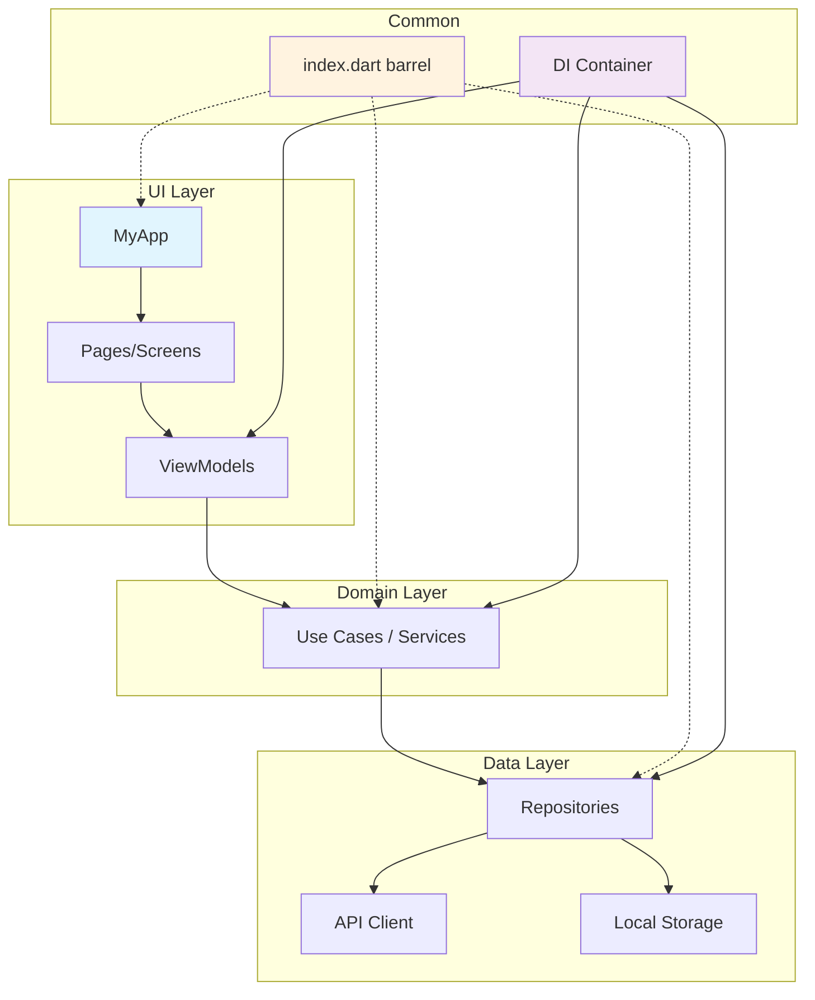

# Concepts — Kiến trúc & Barrel Files

> Mỗi concept dưới đây được trích từ code đã đọc trong [01-code-walk.md](./01-code-walk.md). Cycle: **CODE → EXPLAIN → PRACTICE**.

---

## 1. Barrel File Pattern 🔴 MUST-KNOW

**WHY:** Barrel file là **quy tắc import bắt buộc** của project. Vi phạm = lint error + code review reject.

<!-- AI_VERIFY: base_flutter/lib/index.dart#L1-L5 -->
```dart
/// GENERATED CODE - DO NOT MODIFY BY HAND
/// Generated by: dart tools/dart_tools/lib/export_all_files.dart

export 'app_initializer.dart';
export 'common/config.dart';
```
<!-- END_VERIFY -->
→ Đã đọc trong [01-code-walk § index.dart](./01-code-walk.md#indexdart--barrel-file-của-toàn-bộ-project)

**EXPLAIN:**

Barrel file là file **chỉ chứa `export` statements**, re-export toàn bộ public API của một module/project qua **1 điểm duy nhất**.

**Cách hoạt động trong base_flutter:**

```
Developer tạo file mới:  lib/common/helper/new_helper.dart
      ↓
Chạy `make ep` (export): dart tools/.../export_all_files.dart lib
      ↓
Tool quét lib/:           tìm tất cả .dart files (trừ generated, test)
      ↓
Generate index.dart:      export 'common/helper/new_helper.dart'; ← thêm dòng
      ↓
Mọi file khác import:    import '../index.dart';  ← tự động có new_helper
```

**Rules từ [common_coding_rules.md](../../base_flutter/docs/technical/common_coding_rules.md):**

| Rule | Ví dụ |
|------|-------|
| Mọi public file **phải** export qua `index.dart` | `make ep` tự động |
| Import **luôn** qua `index.dart` | `import '../../../index.dart';` |
| **KHÔNG** import file trực tiếp | ~~`import '../models/user.dart';`~~ |
| Chạy `make ep` khi thêm/xóa file | Trước khi commit |

```dart
// ✅ GOOD — import barrel file
import '../../../index.dart';

// ❌ BAD — import file trực tiếp
import '../models/user.dart';
import './widgets/button.dart';
```

**Tại sao không import trực tiếp?**
1. **Consistency** — 1 cách import duy nhất, dễ review
2. **Refactor-safe** — đổi tên folder/file → chỉ cần update `index.dart` (auto `make ep`)
3. **Simplified imports** — barrel file tạo **star topology**: mọi file đều import `index.dart` (trung tâm), giúp import paths đơn giản và nhất quán. Tuy nhiên, barrel file **không tự ngăn circular dependency** — nếu hai files export qua cùng barrel nhưng import lẫn nhau qua barrel, cycle vẫn xảy ra. Circular dependency được ngăn bởi **layer architecture discipline**: layer dưới không import layer trên (xem [Section 3](#3-layer-architecture-should-know)). Dart analyzer sẽ flag circular imports nếu vi phạm.
4. **IDE autocomplete** — tất cả symbols available qua 1 import

> 💡 **FE Perspective**
> **Flutter:** Barrel file (`index.dart`) được **auto-generate** bởi `make ep` — không cần maintain manual, đặc biệt hữu ích khi project có 100+ files.
> **React/Vue tương đương:** `index.ts` barrel file cũng re-export modules, nhưng phải **maintain thủ công** — thêm file mới phải tự thêm export.
> **Khác biệt quan trọng:** Dart barrel auto-generated → zero maintenance cost. JS/TS barrel phải manual update → dễ quên, gây import errors.

**PRACTICE:** Mở [index.dart](../../base_flutter/lib/index.dart), tìm export của `AppPreferences`. Trace ngược: file nào import `AppPreferences` và dùng pattern nào?

---

## 2. Import Convention 🔴 MUST-KNOW

**WHY:** Import sai = lint error. Team rule bắt buộc — mọi developer phải tuân thủ.

<!-- AI_VERIFY: base_flutter/lib/ui/my_app.dart#L1-L9 -->
```dart
import 'package:auto_route/auto_route.dart';
import 'package:device_preview_plus/device_preview_plus.dart';
import 'package:flutter/foundation.dart';
import 'package:flutter/material.dart';
import 'package:flutter_localizations/flutter_localizations.dart';
import 'package:hooks_riverpod/hooks_riverpod.dart';

import '../index.dart';
```
<!-- END_VERIFY -->
→ Đã đọc trong [01-code-walk § my_app.dart](./01-code-walk.md#myapp-class--hookconsumerwidget)

**EXPLAIN:**

Dart imports chia 3 nhóm, **theo thứ tự bắt buộc**:

| Nhóm | Prefix | Ví dụ | Separator |
|------|--------|-------|-----------|
| 1. Dart SDK | `dart:` | `import 'dart:async';` | empty line |
| 2. Packages | `package:` | `import 'package:flutter/material.dart';` | empty line |
| 3. Project files | relative path | `import '../index.dart';` | — |

**Quy tắc project-specific:**
- Nhóm 3 **chỉ import** `index.dart` — không import file khác
- Exception duy nhất: `di.dart` import `di.config.dart` (generated file, comment `// ignore: prefer_importing_index_file`)
- Linter rule `prefer_importing_index_file` (custom lint) — enforce rule này

```dart
// ✅ CORRECT — 3 nhóm, separator rõ ràng
import 'dart:async';

import 'package:flutter/material.dart';
import 'package:hooks_riverpod/hooks_riverpod.dart';

import '../index.dart';
```

```dart
// ❌ WRONG — import trực tiếp, không qua barrel
import 'dart:async';

import 'package:flutter/material.dart';

import '../common/config.dart';         // ← BAD: direct import
import '../data_source/api/app_api_service.dart'; // ← BAD
```

> 💡 **FE Perspective**
> **Flutter:** Import chia 3 nhóm (`dart:` → `package:` → relative), project rule bắt buộc nhóm 3 chỉ import `index.dart` barrel file — linter enforce tự động.
> **React/Vue tương đương:** ESLint `import/order` cũng chia nhóm (node_modules → aliased → relative), nhưng cho phép relative imports tự do.
> **Khác biệt quan trọng:** Dart convention **nghiêm ngặt hơn** — chỉ 1 import path duy nhất cho project files. JS/TS cho phép import bất kỳ file nào trực tiếp.

**PRACTICE:** Mở bất kỳ file trong `lib/ui/page/` — xác nhận project import chỉ là `import '...index.dart'`.

---

## 3. Layer Architecture 🟡 SHOULD-KNOW

**WHY:** Hiểu layer boundaries để đặt code đúng chỗ. File mới → biết ngay thuộc layer nào.

<!-- AI_VERIFY: base_flutter/lib/index.dart#L4-L30 -->
```dart
export 'app_initializer.dart';
export 'common/config.dart';
export 'common/constant.dart';
// ... common layer exports
export 'data_source/api/app_api_service.dart';
// ... data_source layer exports
export 'exception/app_exception.dart';
// ... exception layer exports
export 'model/api/base/data_response.dart';
// ... model layer exports
export 'navigation/app_navigator.dart';
// ... navigation layer exports
export 'resource/app_colors.dart';
// ... resource layer exports
export 'ui/base/base_page.dart';
// ... ui layer exports
```
<!-- END_VERIFY -->
→ Đã đọc trong [01-code-walk § layer structure](./01-code-walk.md#layer-structure-qua-indexdart-exports)

**EXPLAIN:**

Project tổ chức theo **layer-based Clean Architecture variant** với **7 layers** — mỗi layer có trách nhiệm riêng:

| Layer | Trách nhiệm | Ví dụ files | Depends on |
|-------|-------------|-------------|------------|
| `common/` | Config, constants, helpers, utils | `Config`, `Log`, `ConnectivityHelper` | (none — foundation) |
| `data_source/` | API calls, database, Firebase, storage | `AppApiService`, `AppDatabase` | `common/`, `model/` |
| `exception/` | Error types, mappers, handlers | `AppException`, `DioExceptionMapper` | `common/` |
| `model/` | Data classes, enums, converters | `UserData`, `Gender`, `ApiDateTimeConverter` | `common/` |
| `navigation/` | Routing, guards, observers | `AppRouter`, `RouteGuard` | `common/`, `model/` |
| `resource/` | Colors, fonts, images, themes | `AppColors`, `lightTheme`, `AppImages` | (none — constants) |
| `ui/` | Pages, components, popups, view models | `HomePage`, `CommonAppBar`, `LoginViewModel` | all other layers |

**Dependency direction:** `ui/` → `navigation/` → `data_source/` → `model/` → `common/`. Layer dưới **KHÔNG import** layer trên.

> Xem dependency graph bên dưới cho full picture.

> 💡 **FE Perspective**
> **Flutter:** Project dùng **layer-based architecture** (theo trách nhiệm) — 7 folders theo loại code (common, data, UI...), dependency direction rõ ràng top→bottom.
> **React/Vue tương đương:** Clean Architecture / Feature-Sliced Design. Angular dùng layer-based tương tự (`core/`, `shared/`), React hiện đại prefer feature-based (`features/auth/`, `features/home/`).
> **Khác biệt quan trọng:** Layer-based dễ tìm code theo loại nhưng file liên quan đến 1 feature nằm rải rác. Feature-based gom liên quan gần nhau nhưng khó enforce dependency rules.

**Dependency Graph — luồng phụ thuộc giữa các layers:**

```
         ┌──────┐
         │  ui/ │
         └──┬───┘
            │
     ┌──────┼──────────┬──────────┐
     ▼      ▼          ▼          ▼
navigation/ data_source/ exception/ resource/
     │      │          │
     ▼      ▼          ▼
     ┌──────┴──────┐   │
     │   model/    │   │
     └──────┬──────┘   │
            │    ┌─────┘
            ▼    ▼
        ┌──────────┐
        │ common/  │
        └──────────┘
        ┌──────────┐
        │resource/ │  ← independent (constants)
        └──────────┘
```

**Rule:** Mũi tên chỉ hướng phụ thuộc — layer dưới **KHÔNG** import layer trên. Vi phạm = circular dependency.

> 🗺️ **Concrete Mapping — Flutter lib/ → Next.js App Router**
>
> | Flutter `lib/` | Next.js equivalent | Role |
> |---|---|---|
> | `ui/page/` | `app/` (route segments) | Page components |
> | `ui/component/` | `components/` | Shared UI widgets |
> | `common/` | `lib/` or `utils/` | Helpers, constants, config |
> | `model/` | `types/` or `interfaces/` | Data models, DTOs |
> | `data_source/` | `lib/api/` or `services/` | API calls, repositories |
> | `resource/` | `styles/` or `theme/` | Theme tokens, fonts, images |
> | `navigation/` | `app/` folder structure + `middleware.ts` | Route config, guards |
> | `exception/` | `lib/errors/` | Error types, handlers |
> | `di.dart` | `lib/container.ts` (TSyringe) hoặc React Context providers | Dependency injection |
>
> **Note:** Next.js dùng **folder-based routing** (file = route). Flutter dùng **code-based routing** (AutoRoute annotations). Cả hai đều map URL → Page component, chỉ khác mechanism.

**PRACTICE:** Với yêu cầu "thêm màn hình Settings", liệt kê files cần tạo và layer chứa mỗi file. (Gợi ý: ít nhất 3 files ở 2 layers)

### 🗺️ Architecture Diagram



---

## 4. DI Registration Types 🟡 SHOULD-KNOW

**WHY:** Chọn sai registration type → memory leak (singleton không cần thiết) hoặc stale state (factory khi cần singleton).

<!-- AI_VERIFY: base_flutter/lib/di.config.dart (gitignored — tự động regenerate, xem lưu ý ở M2 § di.config.dart) -->
```dart
// Generated output (example structure — file regenerated on every `make fb`):
// gh.factory<JsonArrayErrorResponseDecoder>(() => JsonArrayErrorResponseDecoder());
// gh.factory<JsonObjectErrorResponseDecoder>(() => JsonObjectErrorResponseDecoder());
// gh.factory<LineErrorResponseDecoder>(() => LineErrorResponseDecoder());
// await gh.factoryAsync<SharedPreferences>(() => serviceModule.prefs, preResolve: true);
// gh.lazySingleton<FirebaseFirestoreService>(() => FirebaseFirestoreService());
// gh.lazySingleton<FirebaseMessagingService>(() => FirebaseMessagingService());
// gh.lazySingleton<UploadFileServerApiClient>(() => UploadFileServerApiClient());
// gh.lazySingleton<RawApiClient>(() => RawApiClient());
```
<!-- END_VERIFY -->
→ Đã đọc trong [01-code-walk § di.config.dart](./01-code-walk.md#diconfigdart--di-container-architecture)

**EXPLAIN:**

3 registration types trong `di.config.dart`:

| Type | Annotation | Behavior | Khi nào dùng |
|------|-----------|----------|-------------|
| `factory` | `@injectable` | Tạo instance **mới** mỗi lần `get<T>()` | Stateless objects (decoders, guards) |
| `lazySingleton` | `@lazySingleton` | Tạo **1 lần**, lazy init | Services giữ state (API clients, helpers) |
| `factoryAsync` | `@preResolve` trong `@module` | Async factory, resolve trước DI ready | Platform deps (SharedPreferences) |

**Ví dụ từ project:**

```dart
// factory — mỗi lần cần RouteGuard tạo mới
// Tại sao? RouteGuard check auth state → cần fresh instance
@injectable  // ← annotation trong source file
class RouteGuard extends AutoRouteGuard { ... }
// → generated: gh.factory<RouteGuard>(() => RouteGuard(gh<AppPreferences>()));

// lazySingleton — AppApiService dùng chung toàn app
// Tại sao? Giữ connection pool, interceptor chain → share state
@lazySingleton  // ← annotation trong source file
class AppApiService { ... }
// → generated: gh.lazySingleton<AppApiService>(() => AppApiService(...));

// factoryAsync — SharedPreferences cần async init
@module
abstract class ServiceModule {
  @preResolve
  Future<SharedPreferences> get prefs => SharedPreferences.getInstance();
}
// → generated: await gh.factoryAsync<SharedPreferences>(..., preResolve: true);
```

**Chọn sai thì sao?**
- Dùng `factory` cho API client → mỗi request tạo client mới → tốn memory, mất interceptor state
- Dùng `lazySingleton` cho RouteGuard → auth state cũ → cho phép truy cập sai

> 💡 **FE Perspective**
> **Flutter:** 3 DI registration types: `factory` (instance mới mỗi lần), `lazySingleton` (1 instance toàn app), `factoryAsync` (async init, pre-resolve).
> **React/Vue tương đương:** `factory` ≈ new instance mỗi component mount, `lazySingleton` ≈ module-level singleton / Redux store, `factoryAsync` ≈ NestJS `useFactory: async` (async dependency initialization, pre-resolve trước khi app ready). NestJS có pattern tương tự: `Scope.DEFAULT` (singleton) vs `Scope.REQUEST` (factory).
> **Khác biệt quan trọng:** Flutter DI container tự quản lý lifecycle (khi nào tạo, khi nào dispose), FE thường manual manage hoặc dựa vào framework lifecycle (component mount/unmount).

**PRACTICE:** Mở [di.config.dart](../../base_flutter/lib/di.config.dart) *(file gitignored — chạy `make fb` để generate trước)*, đếm số lượng `factory`, `lazySingleton`, `factoryAsync`. Tỷ lệ nào nhiều nhất?

---

## 5. App Widget Tree 🟡 SHOULD-KNOW

**WHY:** Hiểu cấu trúc widget tree root để biết theme, routing, localization setup ở đâu.

<!-- AI_VERIFY: base_flutter/lib/ui/my_app.dart#L10-L20 -->
```dart
class MyApp extends HookConsumerWidget {
  const MyApp({required this.initialResource, super.key});

  final InitialResource initialResource;

  @override
  Widget build(BuildContext context, WidgetRef ref) {
    final appRouter = ref.watch(appRouterProvider);

    LocaleSettings.setLocaleRawSync('ja');

    return Consumer(
```
<!-- END_VERIFY -->
→ Đã đọc trong [01-code-walk § MyApp](./01-code-walk.md#myapp-class--hookconsumerwidget)

**EXPLAIN:**

Widget tree root (từ `main.dart` → `my_app.dart`):

```
ProviderScope               ← Riverpod root (M1)
  └── MyApp                 ← HookConsumerWidget
      └── Consumer          ← Rebuild on provider changes
          └── TranslationProvider  ← i18n
              └── DevicePreview     ← Dev tool (disabled in production)
                  └── MaterialApp.router   ← App shell
                      ├── theme: lightTheme        ← resource/ layer
                      ├── routerDelegate            ← navigation/ layer
                      ├── localizationsDelegates    ← i18n delegates
                      └── builder                   ← text scaling, device preview
```

**Mỗi layer đóng góp gì vào widget tree:**
- `common/` → `Config.enableDevicePreview`, `Constant.materialAppTitle`
- `navigation/` → `appRouter.delegate()`, `AppNavigatorObserver()`
- `resource/` → `lightTheme`, `darkTheme`
- `model/` → `InitialResource`
- `ui/base/` → `AppProviderObserver` (trong `ProviderScope` ở `main.dart`)

> 💡 **FE Perspective**
> **Flutter:** Widget tree root: `ProviderScope` → `MyApp (HookConsumerWidget)` → `MaterialApp.router` gom theme, routing, i18n trong 1 widget.
> **React/Vue tương đương:** `Provider` (Redux) → `ThemeProvider` → `IntlProvider` → `BrowserRouter` → `App` — nhiều provider lồng nhau.
> **Khác biệt quan trọng:** Flutter gom routing/theme/i18n vào `MaterialApp` (1 widget), React phải compose nhiều Provider → dễ gây "provider hell", nhưng linh hoạt hơn khi cần tùy chỉnh từng layer.

**PRACTICE:** Vẽ widget tree trên giấy: bắt đầu từ `ProviderScope`, kết thúc ở `MaterialApp.router`. Đánh dấu layer nguồn cho mỗi config value.

---

## 6. Code Generation trong Architecture 🟢 AI-GENERATE

**WHY:** 2/4 file chính là generated. Biết file nào generated để tránh sửa nhầm.

<!-- AI_VERIFY: base_flutter/lib/di.config.dart (gitignored — tự động regenerate) -->
```dart
// Generated output (example structure — file regenerated on every `make fb`):
// GENERATED CODE - DO NOT MODIFY BY HAND
// InjectableConfigGenerator
// [registration code here]
```
<!-- END_VERIFY -->
→ Đã đọc trong [01-code-walk § di.config.dart](./01-code-walk.md#diconfigdart--di-container-architecture)

**EXPLAIN:**

Trong project, có 2 loại file:

| Loại | Ví dụ | Sửa bằng cách |
|------|-------|---------------|
| **Manual** | `di.dart`, `my_app.dart`, mọi file business logic | Edit trực tiếp |
| **Generated** | `di.config.dart`, `index.dart`, `*.g.dart`, `*.gr.dart` | Sửa source → chạy codegen |

**Cách nhận biết file generated:**
1. Comment đầu file: `// GENERATED CODE - DO NOT MODIFY BY HAND`
2. Extension pattern: `*.config.dart`, `*.g.dart`, `*.gr.dart`, `*.freezed.dart`
3. Nằm trong `generated/` folder
4. Được gitignore hoặc commit nhưng không review

**Generated files trong architecture:**

| File | Generator | Command | Source file |
|------|-----------|---------|-------------|
| `index.dart` | `export_all_files.dart` (custom) | `make ep` | Quét toàn bộ `lib/` |
| `di.config.dart` | `injectable_generator` | `make fb` | `di.dart` + classes có `@injectable` |
| `app_router.gr.dart` | `auto_route_generator` | `make fb` | `app_router.dart` |
| `*.g.dart` | `json_serializable` / `freezed` | `make fb` | Model classes |

**Rule:** Nếu có lỗi compile ở file generated → **KHÔNG sửa file generated**. Sửa source file → chạy lại codegen (`make fb` hoặc `make ep`).

> 💡 **FE Perspective**
> **Flutter:** Code generation **phổ biến** — DI, routing, serialization, freezed đều generate code. Lý do: Dart không có runtime reflection (tree shaking) → dùng codegen thay thế.
> **React/Vue tương đương:** `graphql-codegen`, `prisma generate`, `swagger-typescript-api` — nhưng ít phổ biến hơn, chủ yếu cho API/schema.
> **Khác biệt quan trọng:** Dart cần codegen cho nhiều thứ mà JS/TS làm bằng runtime (decorators, reflect-metadata). Trade-off: build step phức tạp hơn nhưng runtime performance tốt hơn.

**PRACTICE:** Trong `lib/`, tìm tất cả file có pattern `*.g.dart` hoặc `*.gr.dart`. Đếm tổng số file generated vs manual.

---

## 📊 Concept Summary

| # | Concept | Badge | Key Takeaway |
|---|---------|-------|-------------|
| 1 | Barrel File Pattern | 🔴 MUST-KNOW | 1 `index.dart` export all, `make ep` auto-generate |
| 2 | Import Convention | 🔴 MUST-KNOW | Luôn import qua `index.dart`, 3 nhóm theo thứ tự |
| 3 | Layer Architecture | 🟡 SHOULD-KNOW | 7 layers, dependency direction top→bottom |
| 4 | DI Registration Types | 🟡 SHOULD-KNOW | `factory` / `lazySingleton` / `factoryAsync` |
| 5 | App Widget Tree | 🟡 SHOULD-KNOW | ProviderScope → MyApp → MaterialApp.router |
| 6 | Code Generation | 🟢 AI-GENERATE | Generated files không sửa tay, sửa source + codegen |

**Phân bố:** 🔴 33% · 🟡 50% · 🟢 17%

---

**Tiếp theo:** [03-exercise.md](./03-exercise.md) — 4 bài tập trên codebase base_flutter.

---

📖 [Glossary](../_meta/glossary.md)

<!-- AI_VERIFY: generation-complete -->
