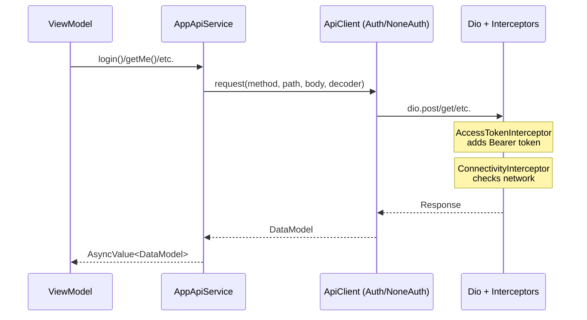

# Concepts — Data Layer & API Integration

> Mỗi concept dưới đây được trích từ code đã đọc trong [01-code-walk.md](./01-code-walk.md). Cycle: **CODE → EXPLAIN → PRACTICE**.

---

## 1. Service Facade Pattern 🔴 MUST-KNOW

**WHY:** `AppApiService` là single entry point cho **tất cả** API calls trong app. ViewModel chỉ cần biết `AppApiService` — không quan tâm client nào (auth/non-auth), interceptor chain gì. Thay đổi infrastructure (đổi Dio sang http package) → chỉ sửa bên trong facade, callers không bị ảnh hưởng.

<!-- AI_VERIFY: base_flutter/lib/data_source/api/app_api_service.dart -->
```dart
@LazySingleton()
class AppApiService {
  AppApiService(
    this._noneAuthAppServerApiClient,
    this._authAppServerApiClient,
    this._uploadFileServerApiClient,
  );
  // Methods: login(), logout(), getMe(), getNotifications(), ...
}
```
<!-- END_VERIFY -->
→ Đã đọc trong [01-code-walk § AppApiService](./01-code-walk.md#6-appapiservice--service-facade)

**EXPLAIN:**

**Facade pattern trong context này:**

```
ViewModel layer
    ↓ (chỉ biết)
AppApiService (facade)
    ↓ (delegate to)
┌─────────────────────────────────────┐
│ NoneAuthClient  AuthClient  Upload  │
│      ↓              ↓          ↓    │
│   RestApiClient (shared base)       │
│      ↓                              │
│   DioBuilder → Dio + Interceptors   │
└─────────────────────────────────────┘
```

**Quyết định client nào cho method nào:**

| Endpoint type | Client | Lý do |
|--------------|--------|-------|
| `login`, `forgotPassword` | `_noneAuthAppServerApiClient` | Chưa có token |
| `getMe`, `logout`, `deleteAccount` | `_authAppServerApiClient` | Cần Bearer token |
| `uploadFileToS3` | `_uploadFileServerApiClient` | Upload binary, header khác |

**DI + Provider bridge:**

```dart
final appApiServiceProvider = Provider<AppApiService>(
  (ref) => getIt.get<AppApiService>(),
);
```

→ `getIt` manage lifecycle (`@LazySingleton`). Riverpod Provider expose cho Widget/ViewModel tree.
→ ViewModel: `ref.read(appApiServiceProvider).login(...)`.

**Tại sao dùng Facade/Repository Pattern?**

Pattern này hoạt động như **Repository** — abstract hoá data source (API, cache, mock) khỏi ViewModel. ViewModel chỉ biết `AppApiService.login()`, không quan tâm data đến từ REST API, GraphQL, hay local cache. Khi cần swap implementation (ví dụ: thay Dio bằng `http` package, hoặc dùng mock service cho testing), chỉ cần thay đổi bên trong facade — **toàn bộ ViewModel code không bị ảnh hưởng**. Đây là nguyên tắc Dependency Inversion: high-level module (ViewModel) không depend trực tiếp vào low-level module (Dio/HTTP client).

> 💡 **FE Perspective**
> **Flutter:** `AppApiService` là Facade — wrap 2 API clients (auth + non-auth), expose typed methods. ViewModel chỉ gọi facade, không touch HTTP trực tiếp.
> **React/Vue tương đương:** Angular: `@Injectable() class ApiService { constructor(private http: HttpClient) }`. React: `useApi()` hook wrap `axios` instance.
> **Khác biệt quan trọng:** Flutter Facade quản lý multiple clients (auth/non-auth) trong 1 class; FE thường dùng 1 axios instance + interceptor switch.

**PRACTICE:** Quay lại `app_api_service.dart` → đếm xem có bao nhiêu method dùng `_noneAuthAppServerApiClient` vs `_authAppServerApiClient`. Pattern quyết định client nào?

---

## 2. REST Client Architecture 🔴 MUST-KNOW

**WHY:** `RestApiClient` là core của mọi API call. Hiểu generic `request<FirstOutput, FinalOutput>()` → biết cách thêm endpoint mới, debug response decode errors, customize per-call behavior.

<!-- AI_VERIFY: base_flutter/lib/data_source/api/client/base/rest_api_client.dart -->
```dart
Future<FinalOutput?> request<FirstOutput extends Object, FinalOutput extends Object>({
  required RestMethod method,
  required String path,
  Map<String, dynamic>? queryParameters,
  Object? body,
  Decoder<FirstOutput>? decoder,
  SuccessResponseDecoderType? successResponseDecoderType,
  // ...
}) async { ... }
```
<!-- END_VERIFY -->
→ Đã đọc trong [01-code-walk § RestApiClient](./01-code-walk.md#3-restapiclient--generic-rest-client)

**EXPLAIN:**

**Generic Types giải thích:**

```dart
// Ví dụ: GET /v1/me → { "data": { "id": 1, "name": "John" } }
request<UserData, DataResponse<UserData>>(...)
//      ^FirstOutput  ^FinalOutput
//      = model type  = response wrapper
```

- `FirstOutput = UserData` — kiểu bên trong `data` field
- `FinalOutput = DataResponse<UserData>` — toàn bộ response wrapper (có `data`, `meta`, etc.)
- `decoder: (json) => UserData.fromJson(json)` — callback decode `FirstOutput` từ raw JSON

**Khi nào KHÔNG cần generic types:**

```dart
// POST /v1/logout → 200 OK (empty body)
await _authAppServerApiClient.request(
  method: RestMethod.post,
  path: 'v1/logout',
);
// → No generic types, no decoder → request<Object, Object> implicit
```

**Per-call override:**

```dart
// Override decoder type cho specific call
request<NotificationData, PagingDataResponse<NotificationData>>(
  successResponseDecoderType: SuccessResponseDecoderType.paging,  // ← override
  // ...
);
```

→ Client có default `successResponseDecoderType` → method-level override cho pagination, etc.

**PRACTICE:** Tự viết mental model cho call: `GET /v1/users?page=1&limit=10` trả `{ "data": [...], "meta": { "total": 50 } }`. Xác định: `FirstOutput`? `FinalOutput`? `successResponseDecoderType`?

---

## 3. Auth vs Non-Auth Clients 🔴 MUST-KNOW

**WHY:** Chọn sai client → request thiếu token (401 Unauthorized) hoặc gắn token không cần thiết. Phân biệt interceptor chain → hiểu flow token injection + refresh.

<!-- AI_VERIFY: base_flutter/lib/data_source/api/client/auth_app_server_api_client.dart -->
<!-- AI_VERIFY: base_flutter/lib/data_source/api/client/none_auth_app_server_api_client.dart -->

**EXPLAIN:**

**Interceptor chain comparison:**

```
NoneAuth:  Log → Connectivity → Retry → BasicAuth → Header
Auth:      Log → Connectivity → Retry → BasicAuth → Header → AccessToken → RefreshToken
                                                              ^^^^^^^^^^^^   ^^^^^^^^^^^^^
                                                              inject Bearer   auto refresh
```

**Tại sao tách riêng (không dùng 1 client + flag)?**

| Approach | Pros | Cons |
|----------|------|------|
| **1 client + flag** | Ít code hơn | Mỗi request phải check flag, interceptor phức tạp, error-prone |
| **2 clients riêng (hiện tại)** | Clear separation, interceptor chain immutable | Duplicate base interceptors |

→ Base project chọn **2 clients riêng** — interceptor chain fixed tại construction time, không cần runtime check. Trade-off hợp lý cho enterprise apps.

**AccessTokenInterceptor flow:**

```
onRequest(options, handler) {
  token = await _appPreferences.accessToken  // ← đọc từ encrypted storage
  if (token.isNotEmpty) {
    options.headers['Authorization'] = 'Bearer $token'
  }
  handler.next(options)  // ← pass tiếp
}
```

**RefreshTokenInterceptor flow (simplified):**

```
onError(err, handler) {
  if (err.statusCode == 401) {
    if (!_isRefreshing) {
      _isRefreshing = true
      refreshToken()  → save new token
      retry original request
      process queued requests
    } else {
      _queue.add(request)  // ← queue while refreshing
    }
  }
}
```

→ Xem chi tiết interceptors → [Module 13](../module-13-middleware-interceptor-chain/) (forward ref).

> 💡 **FE Perspective**: Pattern giống [Axios interceptors](https://axios-http.com/docs/interceptors) — xem [M04 FE Perspective](../module-04-flutter-ui-basics/02-concept.md) cho mapping chi tiết. Điểm mới: Flutter tách 2 client classes riêng; FE thường dùng 1 instance + conditional logic.

**PRACTICE:** Nếu bạn cần gọi API public (ví dụ: lấy danh sách countries không cần auth), bạn dùng client nào trong `AppApiService`?

### 🗺️ Data Flow



> **Note:** The actual codebase does NOT have a UseCase or Repository layer. The architecture is: **ViewModel → AppApiService → RestApiClient → Dio**.

---

## 4. Response Decoder Pipeline 🟡 SHOULD-KNOW

**WHY:** API server trả JSON dạng khác nhau (`{ "data": {} }` vs `{ "data": [] }` vs `[...]`). Decoder pipeline tự động chọn strategy decode phù hợp — bạn cần biết để specify đúng `successResponseDecoderType` cho mỗi endpoint.

<!-- AI_VERIFY: base_flutter/lib/data_source/api/json_decoder/base_success_response_decoder.dart -->
```dart
enum SuccessResponseDecoderType {
  dataJsonObject,   // { "data": { ... } }
  dataJsonArray,    // { "data": [ ... ] }
  jsonObject,       // { ... }
  jsonArray,        // [ ... ]
  paging,           // { "data": [...], "meta": {...} }
  plain,            // raw
}
```
<!-- END_VERIFY -->
→ Đã đọc trong [01-code-walk § Decoder Pipeline](./01-code-walk.md#-7-response-decoder-pipeline)

**EXPLAIN:**

**Strategy pattern:**

```
BaseSuccessResponseDecoder.fromType(type)
    ↓ (factory method)
DataJsonObjectResponseDecoder  → { "data": { ... } } → DataResponse<T>
DataJsonArrayResponseDecoder   → { "data": [ ... ] } → DataListResponse<T>
PagingDataResponseDecoder      → { "data": [...], "meta": {...} } → PagingDataResponse<T>
JsonObjectResponseDecoder      → { ... } → T directly
PlainResponseDecoder           → raw response (no JSON decode)
```

**Chọn decoder type nào?**

| Response format | `SuccessResponseDecoderType` | Ví dụ API |
|----------------|------------------------------|-----------|
| `{ "data": { "id": 1 } }` | `dataJsonObject` (default) | GET /me, POST /login |
| `{ "data": [{ ... }, { ... }] }` | `dataJsonArray` | GET /users (no paging) |
| `{ "data": [...], "meta": {"page":1} }` | `paging` | GET /notifications?page=1 |
| `{ "url": "..." }` | `jsonObject` | Direct JSON (no wrapper) |
| Raw text/binary | `plain` | Download, redirect |

**Decode error handling:**

```dart
O? map({required dynamic response, Decoder<I>? decoder}) {
  try {
    return mapToDataModel(response: response, decoder: decoder);
  } on RemoteException catch (_) {
    rethrow;
  } catch (e) {
    throw RemoteException(kind: RemoteExceptionKind.decodeError, rootException: e);
  }
}
```

→ Mọi decode error → `RemoteException(kind: decodeError)` — consistent error typing cho M4 handler.

**PRACTICE:** Nếu server trả `[{"id":1}, {"id":2}]` (array trực tiếp, không wrap `"data"`), bạn dùng decoder type nào?

> 💡 **FE Perspective**
> **Flutter:** Dio `Transformer` + custom decoder xử lý raw response → typed model, tách biệt parsing khỏi business logic.
> **React/Vue tương đương:** Axios `transformResponse` + custom deserializer, hoặc React Query `select` option.
> **Khác biệt quan trọng:** Flutter decoder chạy synchronous trên main isolate — response lớn cần `compute()` để tránh jank (web không có vấn đề này vì JSON.parse native).

---

## 5. Error → Exception Mapping 🟡 SHOULD-KNOW

**WHY:** Mọi lỗi HTTP đều qua `DioExceptionMapper` → tạo `RemoteException` với `RemoteExceptionKind` cụ thể. Hiểu mapping → biết cách handle từng loại lỗi ở ViewModel/UI layer.

<!-- AI_VERIFY: base_flutter/lib/exception/exception_mapper/dio_exception_mapper.dart -->
```dart
class DioExceptionMapper extends AppExceptionMapper<RemoteException> {
  DioExceptionMapper(this._errorResponseDecoder);

  @override
  RemoteException map({required Object? exception, required ApiInfo apiInfo}) {
    if (exception is DioException) {
      switch (exception.type) {
        case DioExceptionType.cancel: → RemoteExceptionKind.cancellation
        case DioExceptionType.connectionTimeout:
        case DioExceptionType.receiveTimeout:
        case DioExceptionType.sendTimeout: → RemoteExceptionKind.timeout
        case DioExceptionType.badResponse: → parse status code → specific kind
        case DioExceptionType.connectionError: → RemoteExceptionKind.network
        // ...
      }
    }
  }
}
```
<!-- END_VERIFY -->
→ Đã đọc trong [01-code-walk § _requestAndReturnData](./01-code-walk.md) (lần đầu giới thiệu trong [M4 § DioExceptionMapper](../module-04-flutter-ui-basics/01-code-walk.md))

**EXPLAIN:**

**Mapping table:**

| DioException type | HTTP Status | RemoteExceptionKind | UI Action (M4) |
|------------------|-------------|--------------------|-----------------
| `cancel` | — | `cancellation` | Ignore (user cancelled) |
| `connectionTimeout` | — | `timeout` | Show retry dialog |
| `badResponse` | 401 | Handled by RefreshTokenInterceptor | Auto refresh |
| `badResponse` | 503 | `serverMaintenance` | Show maintenance screen |
| `badResponse` | 4xx/5xx + body | `otherServerDefined` | Show server error message |
| `badResponse` | 5xx no body | `serverUndefined` | Show generic error |
| `connectionError` | — | `network` | Show no-connection dialog |

**Error flow trong RestApiClient:**

```dart
try {
  final response = await _requestByMethod(...);
  // ... decode success
} catch (error, _) {
  throw DioExceptionMapper(
    BaseErrorResponseDecoder.fromType(errorResponseDecoderType ?? this.errorResponseDecoderType),
  ).map(exception: error, apiInfo: ApiInfo(method: method.name, url: path));
}
```

→ `catch` bắt **mọi** exception (DioException, decode error, etc.) → `DioExceptionMapper.map()` → throw `RemoteException`.
→ `ApiInfo` captures method + URL — hữu ích cho debugging/logging.

> 💡 **FE Perspective**: Tương tự Axios response interceptor error handler — xem [M04 § Exception Mapping](../module-04-flutter-ui-basics/02-concept.md) cho mapping chi tiết Dio ↔ Axios.

**PRACTICE:** Nếu server trả 404 Not Found với body `{ "error": "User not found", "error_id": "user_not_found" }`, flow qua DioExceptionMapper sẽ tạo `RemoteException` với kind gì?

---

## 6. Local Storage Patterns 🟡 SHOULD-KNOW

**WHY:** Tokens phải encrypted, flags có thể plain text. Chọn sai storage → security vulnerability (token leak) hoặc over-engineering (encrypt mọi thứ).

<!-- AI_VERIFY: base_flutter/lib/data_source/preference/app_preferences.dart -->
```dart
@LazySingleton()
class AppPreferences {
  AppPreferences(this._sharedPreference)
      : _encryptedSharedPreferences = EncryptedSharedPreferences(prefs: _sharedPreference),
        _secureStorage = const FlutterSecureStorage(...);

  final SharedPreferences _sharedPreference;                          // Tier 1: plain
  late final EncryptedSharedPreferences _encryptedSharedPreferences;  // Tier 2: AES
  final FlutterSecureStorage _secureStorage;                          // Tier 3: hardware
}
```
<!-- END_VERIFY -->

> ⚠️ **Implementation detail:** The actual `AppPreferences` uses `EncryptedSharedPreferences` for token storage. `FlutterSecureStorage` is present in the codebase (marked `// ignore: unused_field`) but not the primary storage mechanism. See `app_preferences.dart` for the actual implementation.

→ Đã đọc overview trong [01-code-walk § AppPreferences](./01-code-walk.md#8-apppreferences--appdatabase--local-storage-preview)

**EXPLAIN:**

**3-tier storage trong codebase:**

| Tier | Class | Encryption | Read | Use case |
|:----:|-------|:----------:|:----:|----------|
| 1 | `SharedPreferences` | ❌ Plain text | Sync | Flags, settings (`isLoggedIn`, `userId`) |
| 2 | `EncryptedSharedPreferences` | ✅ AES (software) | Async | Tokens (`accessToken`, `refreshToken`) |
| 3 | `FlutterSecureStorage` | ✅ Hardware-backed | Async | Reserved (biometric keys, certificates) |

→ Tier càng cao → càng secure nhưng càng chậm. Tier 2 chậm hơn Tier 1 khoảng 10-100x do encrypt/decrypt overhead.

> 📖 **Deep dive:** Phân tích chi tiết từng tier, security classification matrix, encryption trade-offs, logout cleanup patterns, DI registration → xem **[Module 14 — Local Storage](../module-14-local-storage/)**. M14 là nguồn tài liệu chính thức cho toàn bộ local storage concepts.

**Nguyên tắc cốt lõi:**
- ⚠️ Token → **luôn** encrypted (`EncryptedSharedPreferences`)
- Flags/settings → plain `SharedPreferences` (performance tốt hơn 10-100x)
- Future sensitive binary → `FlutterSecureStorage` (OS-level security)

**PRACTICE:** Nếu bạn cần lưu device FCM token, bạn chọn storage tier nào? (Hint: FCM token có nhạy cảm không?) → Kiểm tra đáp án tại [M14 § Security Tiers](../module-14-local-storage/02-concept.md).

---

## 7. Data Layer Structure 🟡 SHOULD-KNOW

**WHY:** Tổ chức folder data layer rõ ràng → dễ tìm code, dễ onboard dev mới, scale được khi thêm data sources (GraphQL, WebSocket, etc.).

<!-- AI_VERIFY: base_flutter/lib/data_source/ -->

**EXPLAIN:**

**Separation of concerns:**

```
data_source/
├── api/        → Remote data (HTTP/GraphQL)
├── database/   → Local persistence (structured data)
├── firebase/   → Firebase services (BaaS)
└── preference/  → Key-value storage (settings, tokens)
```

**Mỗi subfolder là một "data source type":**

| Source | Data type | Lifecycle | Example |
|--------|----------|-----------|---------|
| `api/` | Remote server data | Per-request | User profile, notifications |
| `database/` | Cached/offline data | Persistent, queryable | Offline messages, search history |
| `firebase/` | BaaS events + data | Real-time + push | Chat messages, push notifications |
| `preference/` | App config + tokens | Persistent, key-value | Auth state, user settings |

**Khi nào thêm data source mới?**

```
WebSocket real-time? → data_source/websocket/
Local file storage?  → data_source/file_storage/
GraphQL endpoint?    → data_source/api/client/base/graphql_api_client.dart (đã có)
```

> 💡 **FE Perspective**
> **Flutter:** Data layer structure group by data source type: `api/`, `database/`, `preference/`, `firebase/` — mở rộng bằng thêm folder mới (e.g., `websocket/`).
> **React/Vue tương đương:** Angular: `services/`, `interceptors/`, `guards/` cùng level. React: `api/`, `hooks/`, `store/` trong `src/`.
> **Khác biệt quan trọng:** Cùng principle group by data source, nhưng Flutter enforce cứng hơn vì không có barrel exports tự động như JS — mỗi folder là boundary rõ ràng.

**PRACTICE:** Nếu project cần thêm WebSocket cho chat real-time, bạn tạo folder ở đâu? Tạo client pattern như thế nào (tham khảo `RestApiClient`)?

---

### 7.1 Freezed Model Files — AI-GENERATE 🟢

**Model files không phải tự viết — Freezed generate tự động.**

`lib/model/` chứa API models sử dụng Freezed code generation:

<!-- AI_VERIFY: base_flutter/lib/model/api/notification_data.dart -->

**Cấu trúc một model file:**

```dart
import 'package:freezed_annotation/freezed_annotation.dart';
part 'notification_data.freezed.dart';   // Generated: copyWith, ==, hashCode
part 'notification_data.g.dart';          // Generated: fromJson, toJson

@freezed
sealed class NotificationData with _$NotificationData {
  const NotificationData._();

  const factory NotificationData({
    @Default(0) @JsonKey(name: 'id') int id,
    @Default('') @JsonKey(name: 'title') String title,
  }) = _NotificationData;

  factory NotificationData.fromJson(Map<String, dynamic> json) =>
      _$NotificationDataFromJson(json);
}
```

**3 files được tạo tự động:**

| File | Generated by | Nội dung |
|------|-------------|---------|
| `notification_data.freezed.dart` | `freezed` | `copyWith`, `==`, `hashCode`, pattern matching (`map`, `when`) |
| `notification_data.g.dart` | `json_serializable` | `fromJson`, `toJson` |
| (notification_data.dart) | **Developer viết** | Annotation + factory constructors |

**FE developer tương đương:**

| Flutter Freezed | React/TypeScript |
|----------------|-----------------|
| `@freezed` annotation | `type` + `interface` |
| `copyWith()` | `{ ...obj, field: newValue }` (Immer) |
| `fromJson()` | `z.parse()` (Zod) |
| `sealed class` | `discriminated union` |

**Khi nào cần sửa file `.dart` (thủ công)?**
- Thêm field mới
- Thêm factory constructor
- Thêm computed getter
- Thay đổi annotation

**Khi nào cần chạy lại `build_runner`?**
- Sau khi sửa file `.dart`
- Sau khi thêm field
- Sau khi thêm `@JsonKey` annotation

> 💡 **FE Perspective**
> Freezed tự generate tất cả boilerplate — bạn chỉ viết annotation và factory. Tương đương TypeScript `type` + `zod` schema + Immer `produce`, gộp lại thành 1 annotation duy nhất.

**AI Prompt để generate model mới:**

```dart
❌ "Tạo model user"
✅ "Tạo Freezed sealed class UserModel với fields: id (int), name (String),
   email (String), avatarUrl (String?), createdAt (DateTime).
   Dùng @JsonKey(name: 'avatar_url') cho avatarUrl.
   Tương thích với build_runner và json_serializable."
```

**PRACTICE:** Trace `NotificationData` từ source file đến generated files: `notification_data.dart` → `notification_data.freezed.dart` → xem pattern matching methods (`map`, `when`).

---

## 8. Success Response Decoder Types — Two Abstraction Levels 🟢 AI-GENERATE

**WHY:** Có 2 hệ thống naming cho decoder types — **6 types trong source code** (code-walk) và **3 nhóm trong mental model** (concept). Học viên cần hiểu cả hai và mối quan hệ giữa chúng.

**EXPLAIN:**

Xem Section 4 cho chi tiết về SuccessResponseDecoderTypes.

||| Type (Source) | Group (Concept) | Khi nào | Ví dụ |
||---------------|-------------|---------|---------|
| `dataJsonObject` | `nested` | Wrapper `"data"` + object | GET /me |
| `dataJsonArray` | `nested` | Wrapper `"data"` + array | GET /users |
| `paging` | `wrapped` | Wrapper `"data"` + `"meta"` | GET /notifications?page=1 |
| `jsonObject` | `flat` | Không wrapper, object | GET /config |
| `jsonArray` | `flat` | Không wrapper, array | GET /countries |
| `plain` | `wrapped` | Raw response | Download, redirect |


> 💡 **FE Perspective**
> **Flutter:** `SuccessResponseDecoderType` là compile-time strategy pattern — chọn decoder tại compile time, không cần if/else runtime.
> **React/Vue tương đương:** Axios interceptors có `transformResponse` — nhưng Axios decode tất cả response giống nhau, không phân biệt theo endpoint. Flutter approach cho phép type-safe per-endpoint decode.

**PRACTICE:** Khi thêm endpoint mới vào `AppApiService`, bạn chọn decoder type nào? Xem [01-code-walk.md](./01-code-walk.md) để trace cách decoder được chọn.

---

> 📋 Badge summary → xem [00-overview.md](./00-overview.md)

---

→ Tiếp tục: [03-exercise.md](./03-exercise.md) — 5 bài tập thực hành data layer patterns.

---

📖 [Glossary](../_meta/glossary.md)

<!-- AI_VERIFY: generation-complete -->
